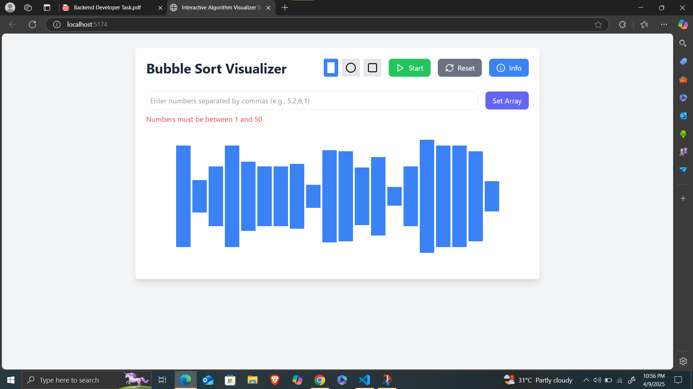

# Algorithm Visualizer

An interactive visualization tool for understanding sorting algorithms, specifically implementing Bubble Sort with a clean, modern interface.

## Project Structure

```
/
├── src/
│   ├── components/        # React components
│   ├── styles/           # CSS styles
│   ├── utils/            # Utility functions
│   ├── types/            # TypeScript types
│   └── assets/           # Static assets
├── public/               # Public assets
└── docs/                 # Documentation
```

## Features

- Interactive visualization of Bubble Sort algorithm
- Real-time sorting with pause/resume capability
- Color-coded elements to track comparisons and swaps
- Detailed algorithm information and complexity analysis

## 🚀 Project Overview

- 📊 **Algorithm**: Bubble Sort
- 🌐 **Frontend**: HTML, CSS, JavaScript (TailwindCSS optional)
- 🎨 **Visualization**: Array elements represented as animated vertical bars
- 🎮 **Controls**: Start, Pause, Reset
- 🧾 **Extras**: Algorithm explanation panel, optional effects via tsParticles or Three.js
- 🐳 **Optional**: Docker support, GitHub Actions CI for linting

## Getting Started

1. Clone the repository
2. Install dependencies: `npm install`
3. Start the development server: `npm run dev`

## Technology Stack

- React
- TypeScript
- Tailwind CSS
- Vite